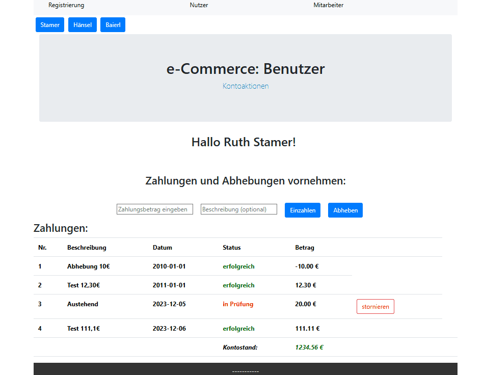

# Finance Dashboard – Spring Boot Backend


> Companion Frontend Repository: [eCommerce-Frontend](https://github.com/TillKaminski/eCommerce-Frontend-Angular)

This repository contains the REST API for a finance transaction dashboard. It was developed as a one-week technical coding challenge to demonstrate a core business workflow: **User Deposits** and **Staff-Authorized Withdrawals.**

---

## 📺 Fullstack Workflow

*User requests a withdrawal (Pending) → Staff authorizes → Transaction completes (Successful) → Balance updates.*

## 🏗️ Architecture
The backend is designed with a service-oriented approach to manage financial transactions and user states efficiently:

- **Centralized Business Logic:** A dedicated **Payment Service** handles the complex transaction lifecycle. It orchestrates updates across both User (balances) and Deposit (status) entities.
- **Transaction Workflow:** 
  - **Submission:** Users trigger a deposit request. The system increments a transaction counter and handles the entry as *pending* without affecting the balance yet.
  - **Authorization:** Staff can "resubmit" these pending entries. The service then processes the final transaction and updates the user's balance.
- **Data Persistence:** Implemented via **Spring Data JPA** (utilizing `JpaRepository`). The relational model ensures data integrity between users and their linked transaction histories.
- **Instant Demo Mode:** Uses an **H2 In-Memory database** pre-populated with test data via `CommandLineRunner` for an immediate "out-of-the-box" demonstration.

## 🛠️ Tech Stack
- **Framework:** Spring Boot (REST API)
- **Persistence:** Spring Data JPA / Hibernate
- **Database:** H2 (Relational, In-Memory)
- **Language:** Java 17

## 🌐 API Endpoints
- Configured Cross-Origin Resource Sharing (**CORS**) for Angular frontend integration.

### Transactions & Payments
Managed via `DepositController` and `PaymentController`.

| Method   | Endpoint                                 | Description                                     |
|:---------|:-----------------------------------------|:------------------------------------------------|
| **POST** | `/api/pay/{userId}/addpayment`           | Create a new transaction for a user.            |
| **GET**  | `/api/{userId}/payments`                 | Get all payments for a specific user.           |
| **GET**  | `/api/{userId}/paymentssorted/{order}`   | Get user payments sorted by date (`up`/`down`). |
| **GET**  | `/api/payments/sum/{begin}/{end}`        | Get total sum of payments in a period.          |
| **GET**  | `/api/payments/summissing/{begin}/{end}` | Get sum of pending payments in a period.        |
| **GET**  | `/api/payments/{begin}/{end}`            | List all transactions in a date range.          |
| **PUT**  | `/api/pay/{userId}/resubpayment`         | Re-submit or authorize a pending payment.       |
| **POST** | `/api/payments/{id}/cancel/{tokenId}`    | Cancel a specific transaction.                  |

### User Management
Managed via `UserController`.

| Method     | Endpoint               | Description                        |
|:-----------|:-----------------------|:-----------------------------------|
| **GET**    | `/api/all`             | List all registered users.         |
| **POST**   | `/api/create`          | Register a new user account.       |
| **PUT**    | `/api/edit`            | Update user account information.   |
| **GET**    | `/api/{userId}`        | Get details of a specific user.    |
| **DELETE** | `/api/delete/{userId}` | Remove a user account.             |
| **GET**    | `/api/allsorted`       | List all users sorted by balances. |

## 🚀 How to Run
Tested on Windows 10/11 using Java 17.

### Option 1: Quick Start (Executable JAR)
1. Download the `.jar` file from the **Releases** section.
2. Ensure **Java 17** is installed (`java -version`).
3. Run the application:
   ```bash
   java -jar ecommerce_backend.jar
   ```
4. **Backend URL**: The API will be available at `http://localhost:8080`.

### Option 2: Development Setup
1. Clone the repository.
2. Ensure you have **Java 17** installed.
3. Run the application:
   ```bash
   ./mvnw spring-boot:run
   ```
4. **Backend URL**: The API will be available at `http://localhost:8080`.

## License

This project is licensed under the MIT License - see the [LICENSE](./LICENSE) file for details.